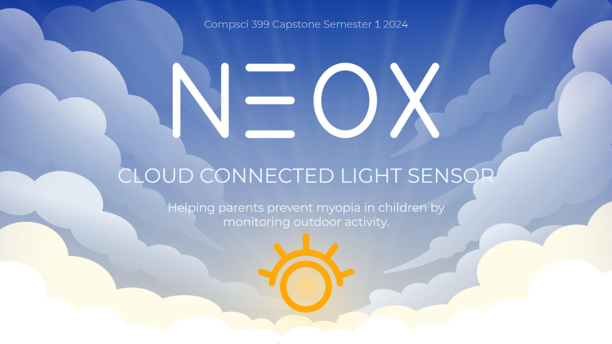

# Cloud Connected Light Sensor by Neox

The Neox Sens is a wearable light monitor prototype based on an Arduino, which can assist in understanding the correlation between light exposure patterns and myopia development in children. The collected data can be synchronised with a cloud database through a dedicated mobile phone application. This application allows parents to monitor and analyse their child's light exposure patterns. Additionally, researchers are able to create studies that parents can opt into, allowing researchers to access and analyse their data. By providing this system for monitoring and analysing users’ light exposure patterns, we expect it to contribute to slowing the progression of myopia for children.

# Project Management

Our project management is freeform, hence you will see that our task board has not been updated for a while.

<https://github.com/orgs/uoa-compsci399-s1-2024/projects/7>

# Building

Each component is organised into their own folder
- hardware
- app
- server
- website

## Hardware

Technologies
- Arduino IDE
- C++

Setup
- Wire the hardware components according to `hardware/wiring/README.md`.
- Install Arduino IDE (<https://www.arduino.cc/en/software>).
- Open `hardware/program/program.ino` in Arduino IDE.
- Install the dependencies listed in `hardware/dependencies.md`.
- Install the build tools for the Arduino Nano IoT 33.
- Connect the Arduino to the computer, select the corresponding serial port and board type, and press run. _Debugging is not possible without special hardware._

## App

APK Download: <https://github.com/uoa-compsci399-s1-2024/capstone-project-2024-s1-team-14-neox/releases>

Technologies
- VSCode/Android Studio
- Flutter
- Dart

Setup
- Install the Flutter SDK, Android SDK, and IDE plugin (<https://docs.flutter.dev/get-started/install/windows/mobile>).
- Connect to a physical phone or Android emulator with ADB.
- Run `flutter run` in the app folder.

More details in `app/BUILD.md`.

## Server

Technologies
- AWS (serverless)
- API Gateway
- Lambda
- Cognito (for auth)
- RDS (PostgreSQL)
- NodeJS

Setup
- Install SAM CLI tool
- Install AWS CLI tool (devs used version 1 which is available from PyPI)
- Configured AWS credentials (via config file or aws configure sso for AWS cli v2)
- Cognito tokens should be *ID* token, NOT
- Access token
- JWT token
- Any other token

More details in `server/BUILD.md` and `server/API.md`.

## Website
URL: <http://neox-frontend-all-dev.s3-website-ap-southeast-2.amazonaws.com>

Technologies
- NodeJS
- React
- HTML, CSS, JS

Setup
- Set up the server (according to whether website is run on localhost or on S3 static site hosting)
- Install npm cli

More details in `website/BUILD.md`.

# Future Plans

Hardware
- Discard samples while stationary to reduce data.
- Resettable authentication code.
- Create wearable case.
- Use external RTC to keep time.

App
- Better gamification/reward system.
- Time series database rather than table based.
- Allow multiple devices per child.

Server
- Fetch samples with a filter.
- Experiment with PostgreSQL extension for time series data to improve performance.
- Online and seasonal classification.
- Account and/or child and/or sample deletion.
- Study deletion.
- Register with Google or Facebook.

Website
- Data visualisation on the website.
- Comments/researcher notes on the website.
