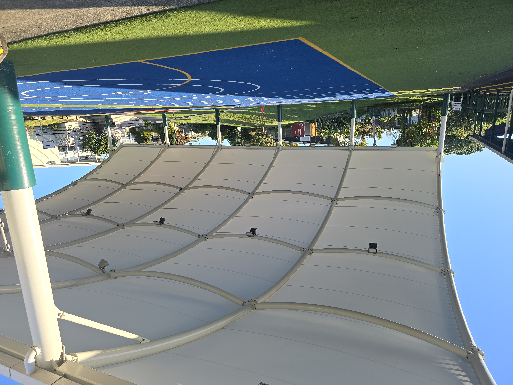
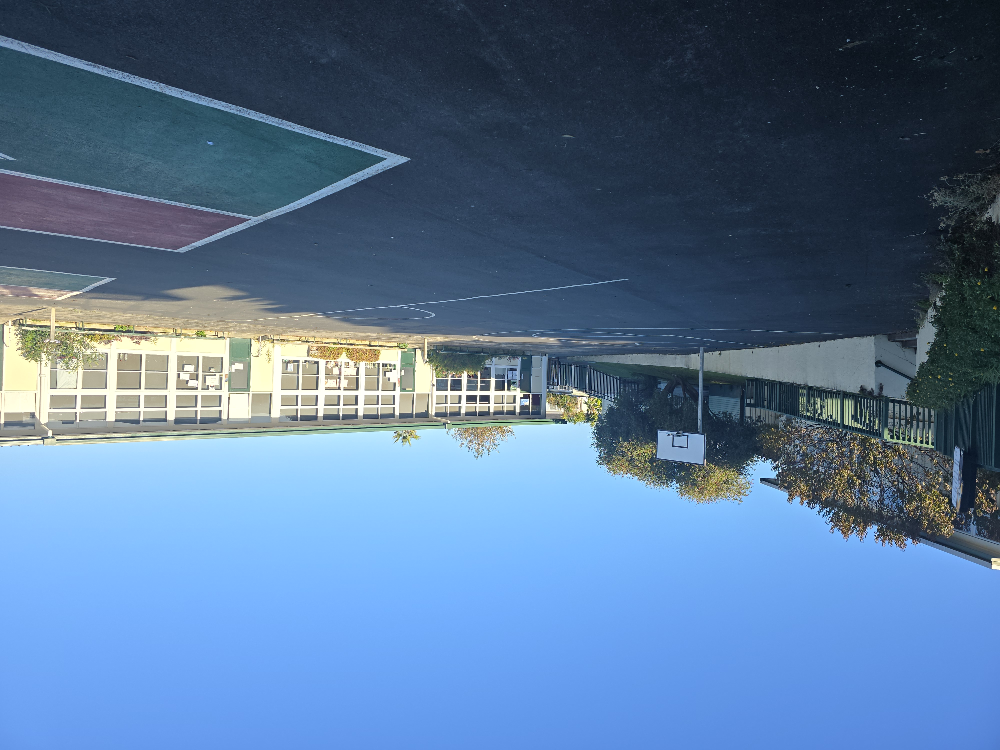
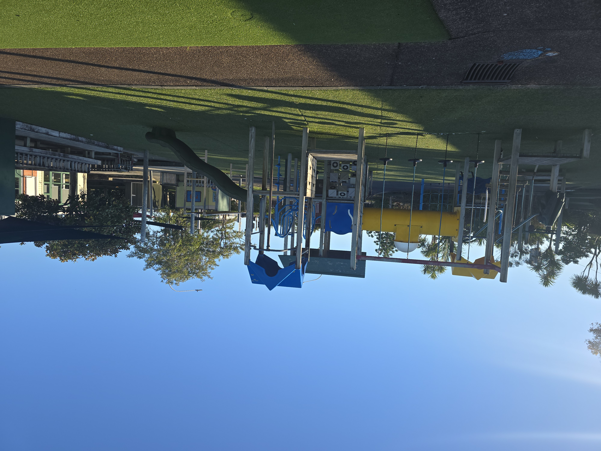
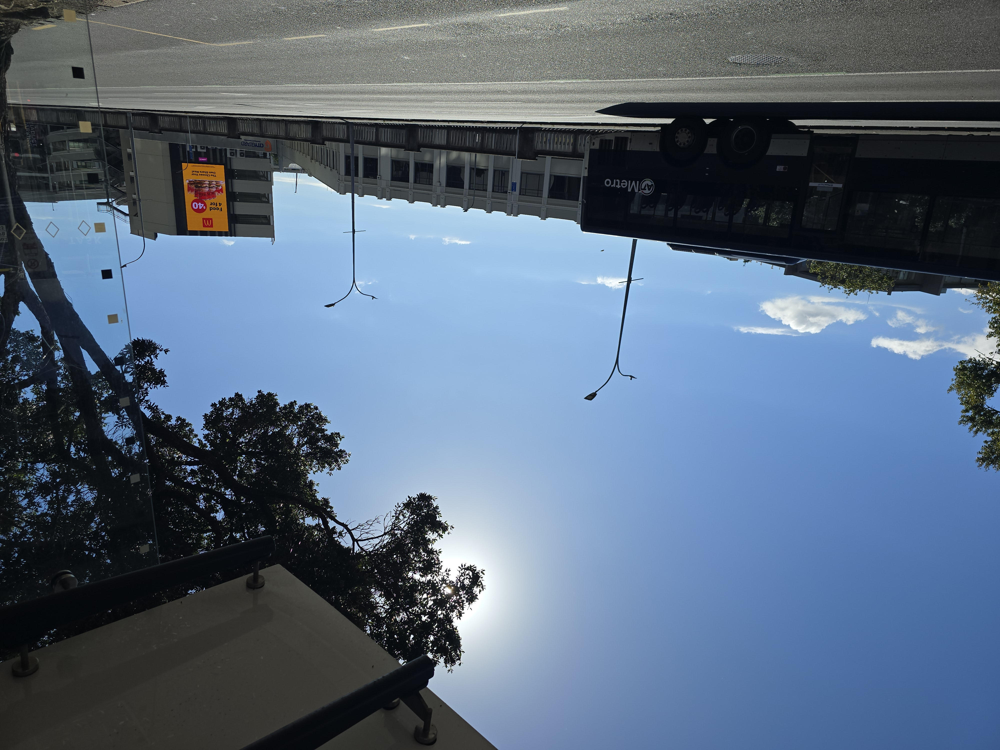
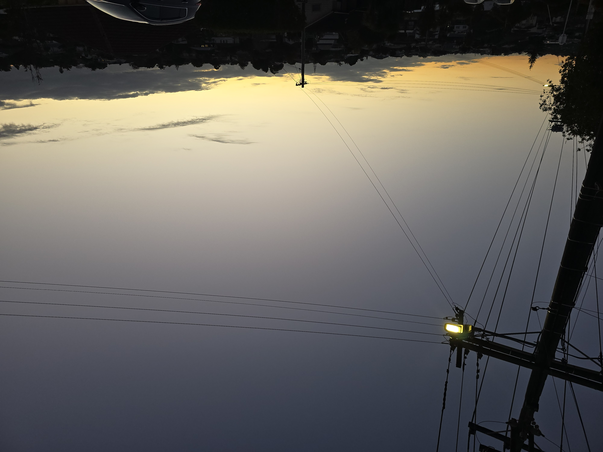
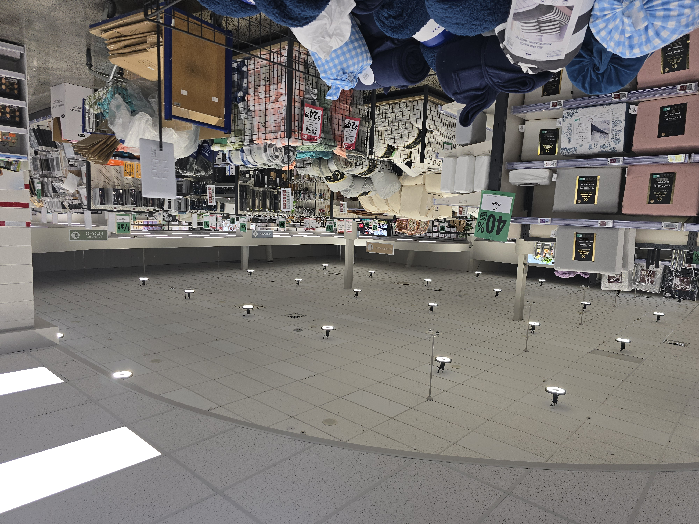
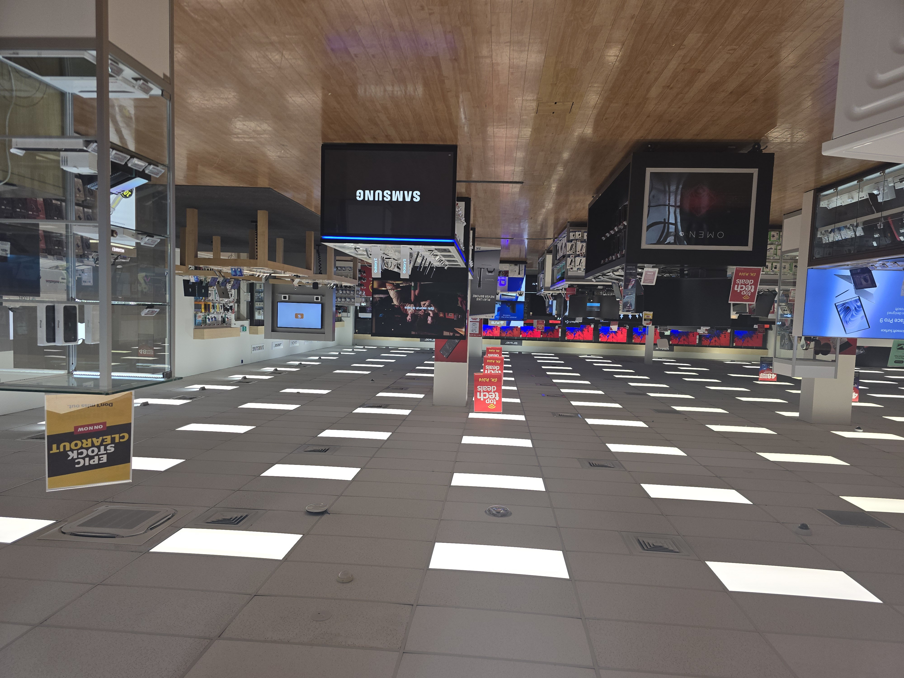
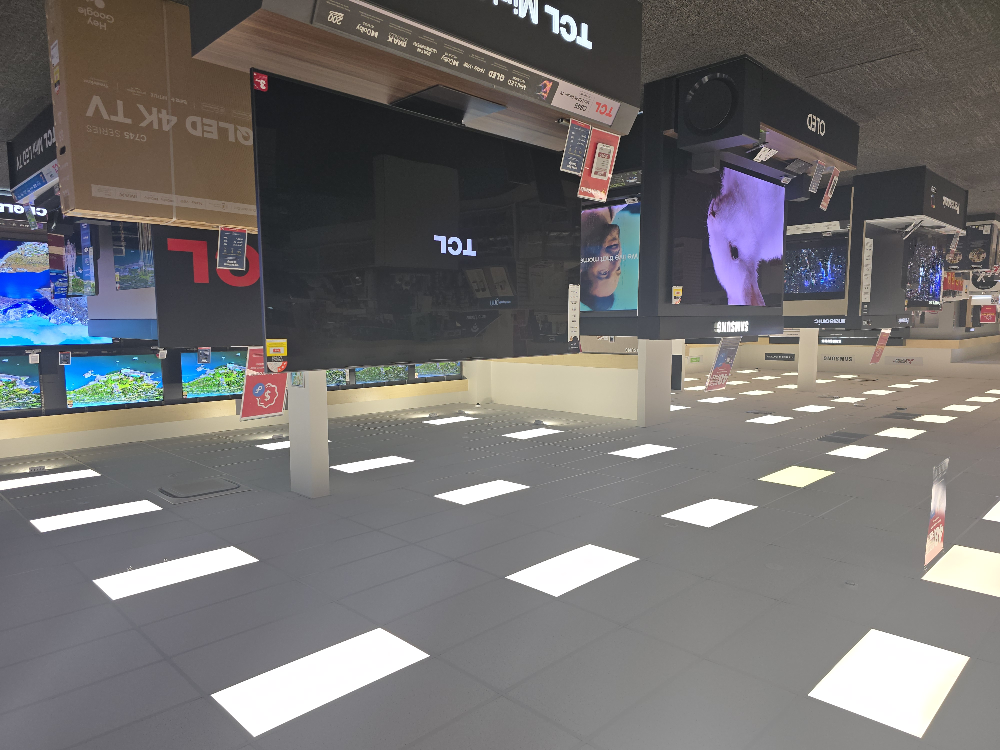
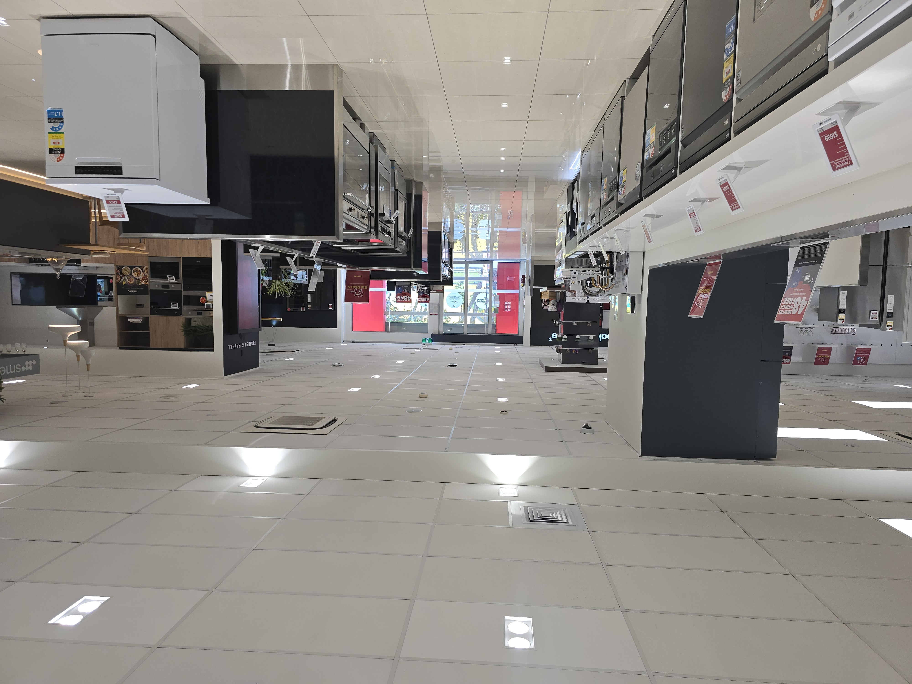

# Classification Environments

##  Without UV

Order:
timestamp,uv,light,accelX,accelY,accelX,r,g,b,c,colorTemp,lux,,

### Outdoor

#### 0001 Morning walk to primary school
Location: Forrest Hill, North Shore
Date & Time: 240504_0822
Setting: Full sunlight, some shade from trees and houses
Activity: walking

#### 0002 Sidewalks in Auckland CBD
Location: Auckland CBD
Date & Time: 240504_1132
Setting: Full sunlight, some shade from buidlings
Activity: walking

#### 0003 Under bus stop in Auckland CBD
Location: Fanshawe St, Auckland CBD
Date & Time: 240504_1219
Setting: Under bus stop covering, direct sunlight, no clouds
Activity: walking

#### 0004 Footpath on Residential Area
Location: Footpath on Residential Area
Date & Time: 240504_1745
Settings: 10 to 20 minutes after sunset at 5:31 pm, some artifical light from streeth lights
Activity: walking

#### 0005 Close to Commercial Buildings
Location: Close to Commercial Buildings
Date & Time: 240505_1424
Settings: Some clouds covering the sun, bright outside, device facing sun
Activity: walking

### Indoor
#### 0001 Retail Store
Location: Briscoes, Glenfield
Date & Time: 240505_1432
Setting: Sunny outside, some sunlight through the door, otherwise full artifical lighting
Activity: walking, standing

#### 0002 Retail Store
Location: Noel Leeming, Glenfield
Date & Time: 240505_1426
Setting: Sunny outside, no sunlight, full artifical lighting
Activity: walking, standing

#### 0003 Retail Store
Location: Galaxy Lighting, Glenfield
Date & Time: 240505_1409
Setting: Sunny outside, some sunlight, bright artifical lighting
Activity: walking

