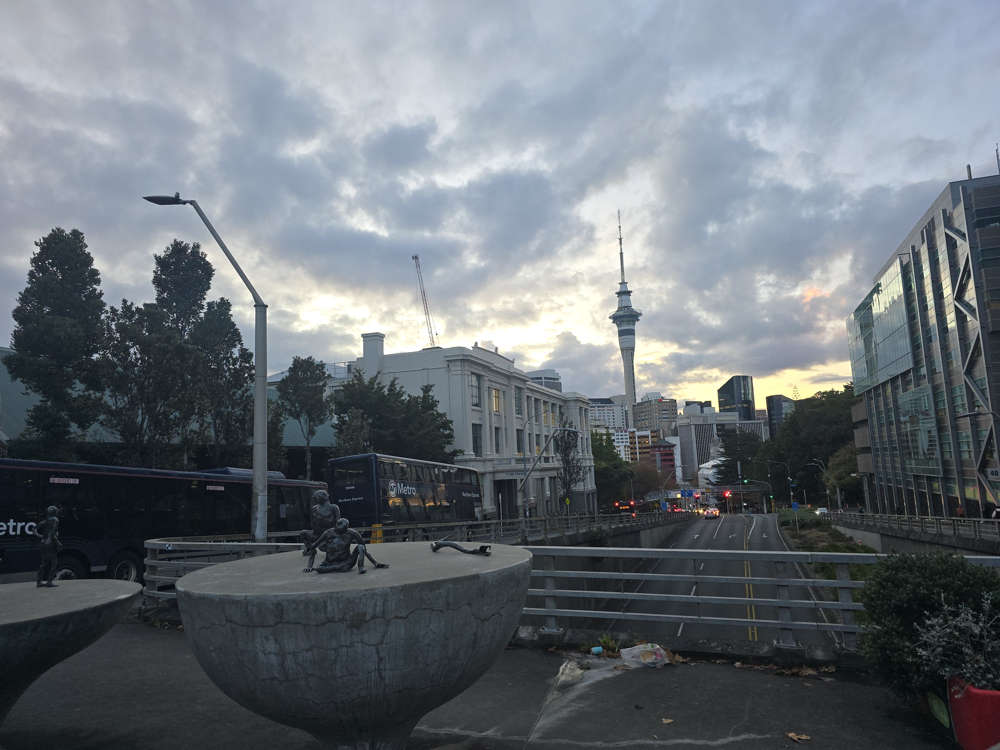
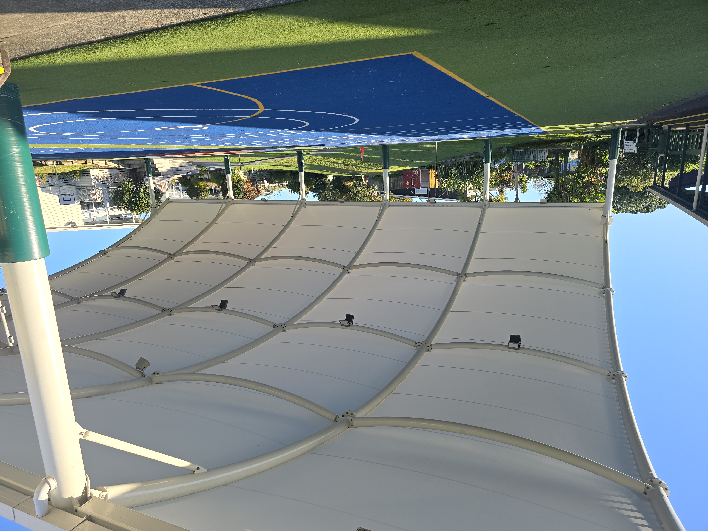
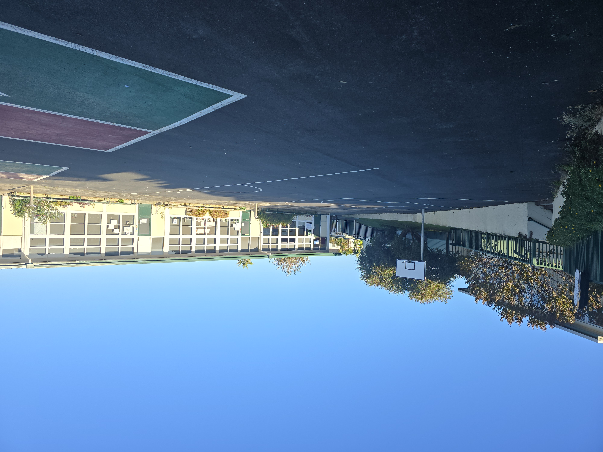
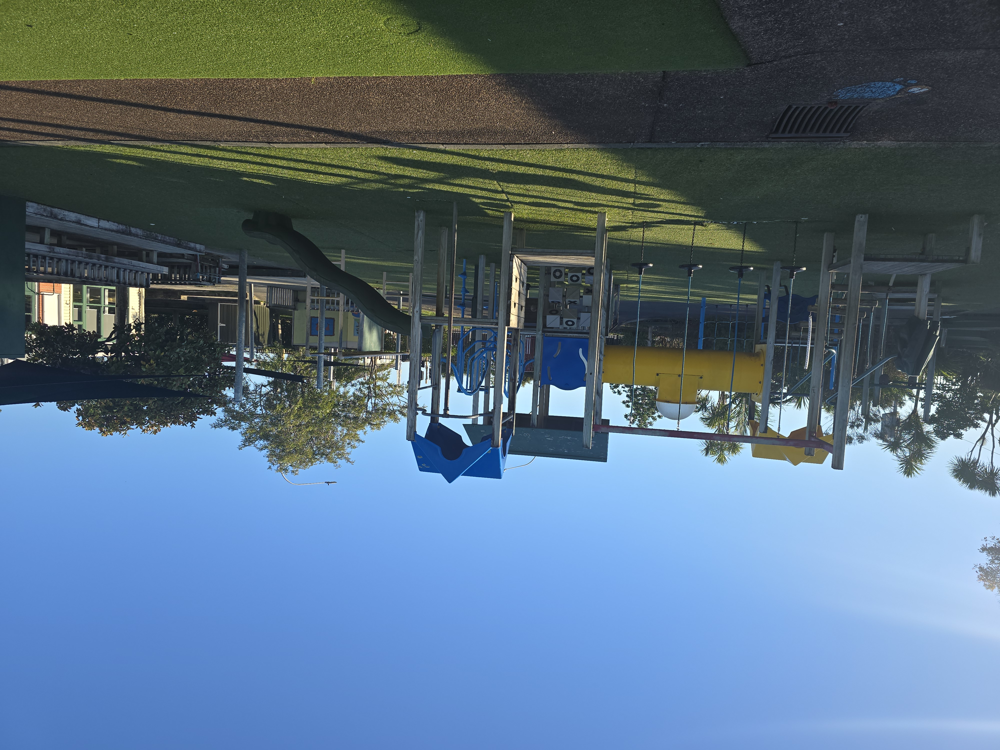
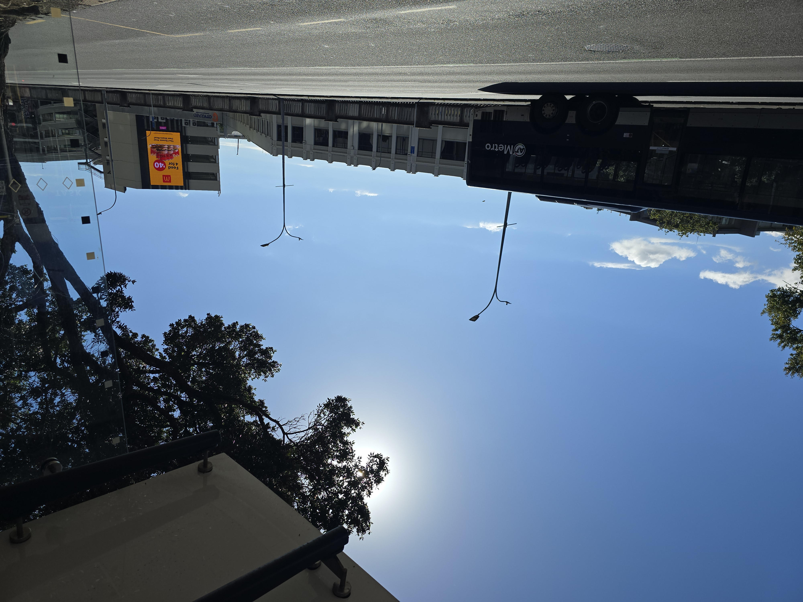
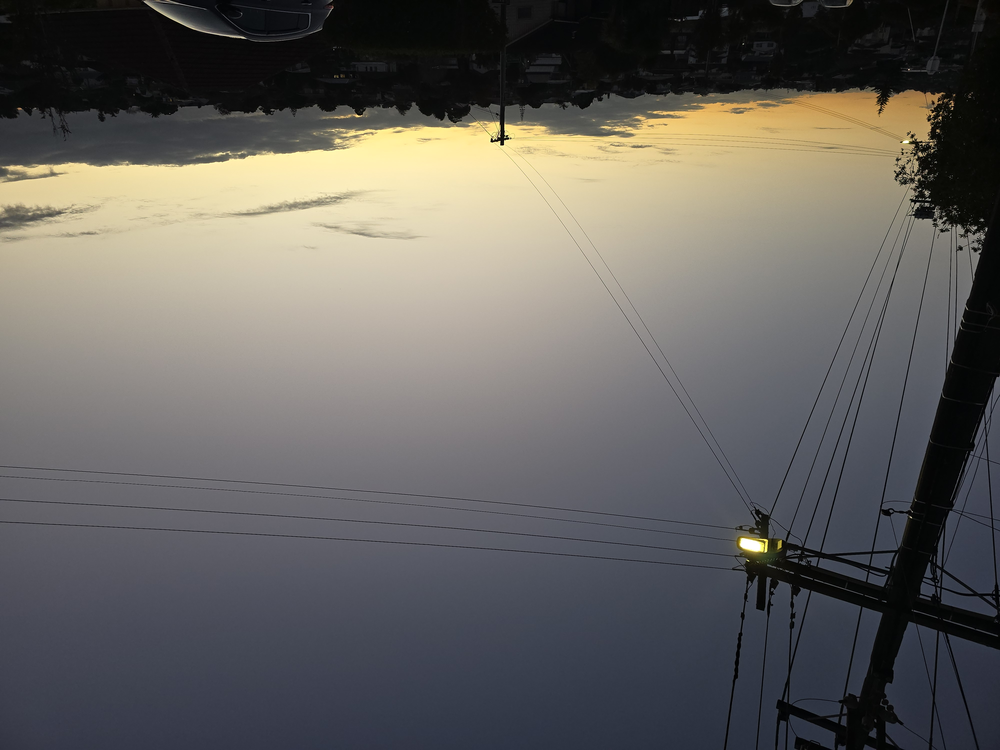
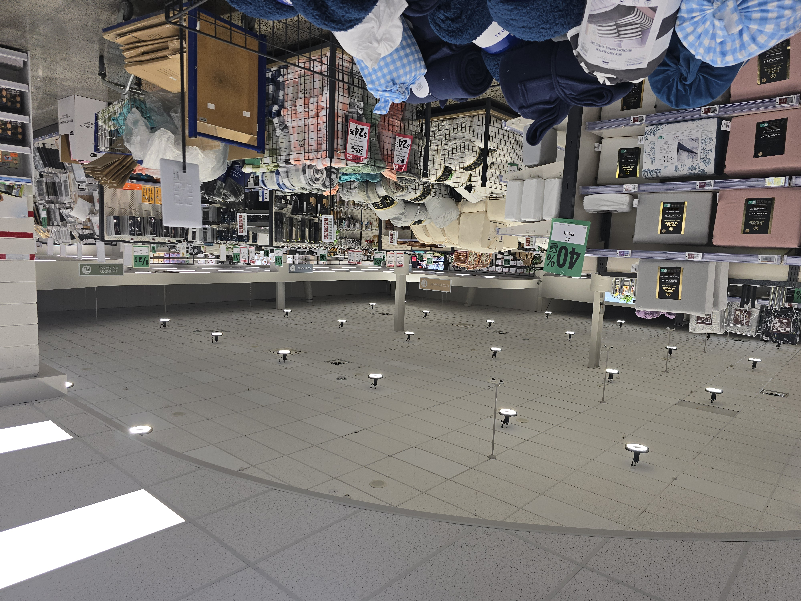
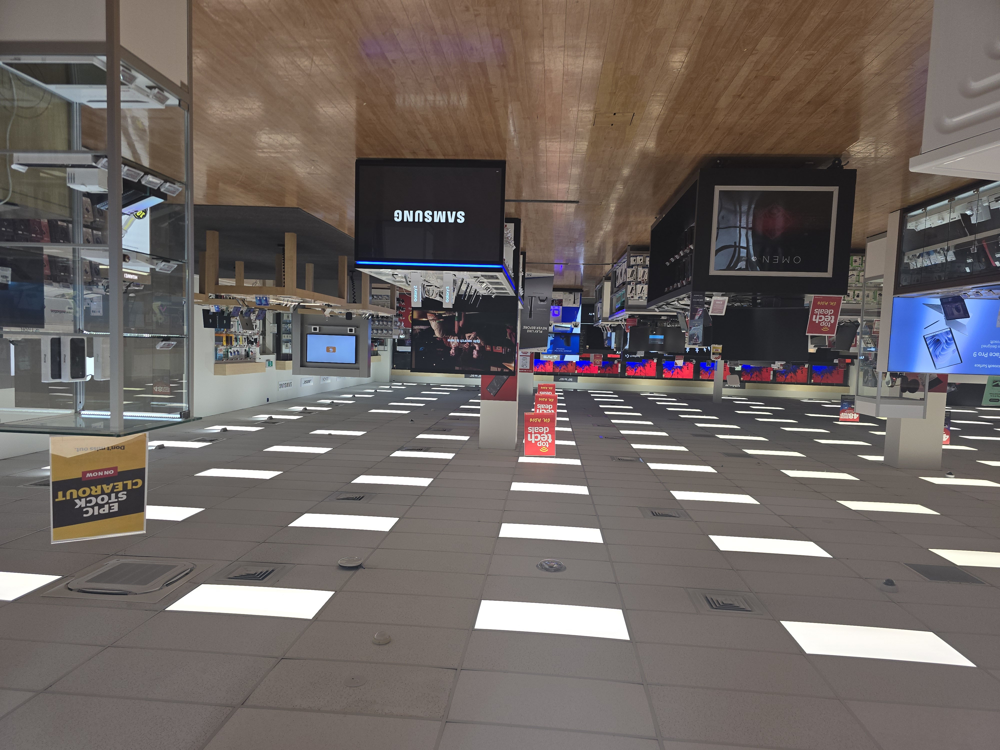
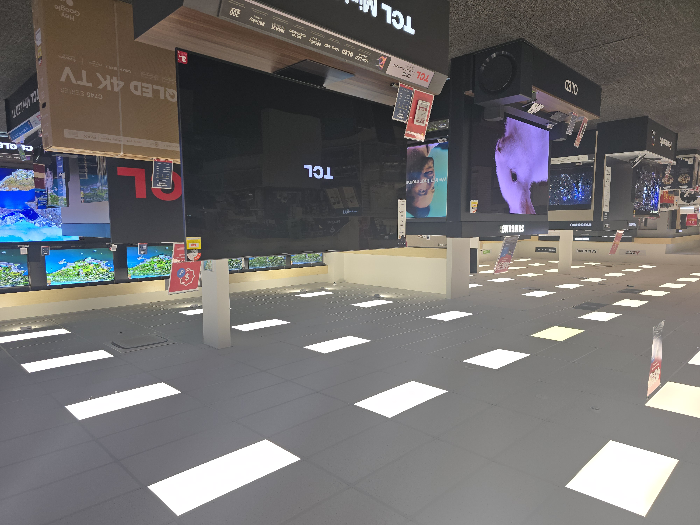
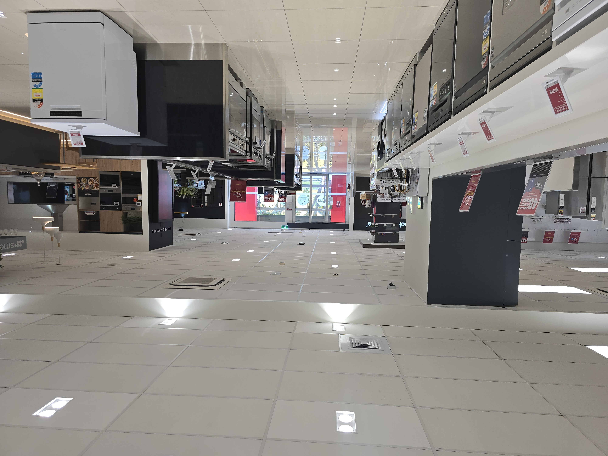

# Classification Environments

## With UV

Order:
timestamp,uv,light,accelX,accelY,accelZ,r,g,b,c,colorTemp,lux,target,code

### Outdoor

#### 1001 Walk in Auckland CBD
Location: Auckland CBD
Date & Time: 20240506_172938
Setting: At sunset in Auckland CBD, walking on sidewalks, some shade from trees and buildings
Activity: walking

#### 1002 Walk to primary school
Location: North Shore
Date & Time: 20240507_084623
Setting: Walking to primary in the morning, some clouds but mostly direct sunlight, brief periods of shade from building and trees
Activity: walking

#### 1003 Park
Location: North Shore
Date & Time: 20240507_145316
Setting: On grass field, full sun, no interference from large trees or buildings
Activity: walking, sitting

#### 1004 Under thick tree shade
Location: North Shore
Date & Time: 
Setting: Under thick tree shade, full sunshine, no clouds
Activity: walking

#### 1005 Walk from primary school
Location: North Shore
Date & Time: 
Setting: Walk from primary school in the afternoon, no clouds covering sun, full sunshine, some shade from trees
Activity: walking

#### 1006 Walk in Takapuna CBD
Location: Takapuna CBD
Date & Time: 20240507_154831
Setting: Walking on sidewalks in Takapuna CBD, adjacent to tall buildings, full sunshine, some shade from covering, 
Activity: walking

####
Location: North Shore
Date & Time:
Setting:
Activity:

#### 

### Indoor

#### 0001 Bus, by window seat
Location: Bus
Date & Time: 20240506_172938
Setting: At sunset in Auckland CBD, Window seat on bus, crossing Harbour Bridge to North Shore
Activity: sitting

#### 0002 Takapuna Library, Children's Area
Location: Takapuna Library, Children's Area
Date & Time: 20240507_155818
Setting: White LED artificial lighting, some sunlight from windows but no direct sunlight, sunny, orange coloured feature wall
Activity: sitting

#### 0003 Takapuna Library, General Area
Location: Takapuna Library, General Area
Date & Time: 20240507_155818
Setting: White LED artificial lighting, small ambient light from windows that are far away, sunny, no direct sunlight
Activity: sitting, walking

#### 0004 Takapuna Library, General Area
Location: Takapuna Library, General Area
Date & Time: 20240507_155818
Setting: White LED artificial lighting, adjacent to large window, full sunlight onto sensor, sunny with no clouds
Activity: sitting

##  Without UV

Order:
timestamp,uv,light,accelX,accelY,accelZ,r,g,b,c,colorTemp,lux,class,code

### Outdoor

#### Morning walk to primary school
Location: Forrest Hill, North Shore
Date & Time: 240504_0822
Setting: Full sunlight, some shade from trees and houses
Activity: walking

#### Sidewalks in Auckland CBD
Location: Auckland CBD
Date & Time: 240504_1132
Setting: Full sunlight, some shade from buidlings
Activity: walking

#### Under bus stop in Auckland CBD
Location: Fanshawe St, Auckland CBD
Date & Time: 240504_1219
Setting: Under bus stop covering, direct sunlight, no clouds
Activity: walking

#### Footpath on Residential Area
Location: Footpath on Residential Area
Date & Time: 240504_1745
Settings: 10 to 20 minutes after sunset at 5:31 pm, some artifical light from streeth lights
Activity: walking

#### Close to Commercial Buildings
Location: Close to Commercial Buildings
Date & Time: 240505_1424
Settings: Some clouds covering the sun, bright outside, device facing sun
Activity: walking

### Indoor
####Retail Store
Location: Briscoes, Glenfield
Date & Time: 240505_1432
Setting: Sunny outside, some sunlight through the door, otherwise full artifical lighting
Activity: walking, standing

#### Retail Store
Location: Noel Leeming, Glenfield
Date & Time: 240505_1426
Setting: Sunny outside, no sunlight, full artifical lighting
Activity: walking, standing

#### Retail Store
Location: Galaxy Lighting, Glenfield
Date & Time: 240505_1409
Setting: Sunny outside, some sunlight, bright artifical lighting
Activity: walking

